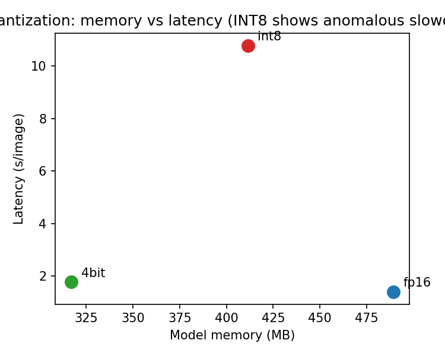
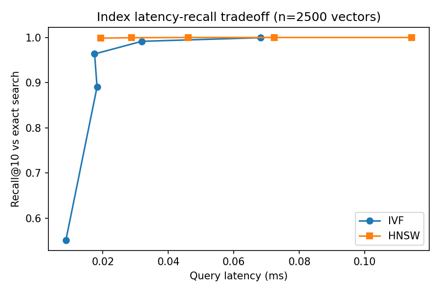
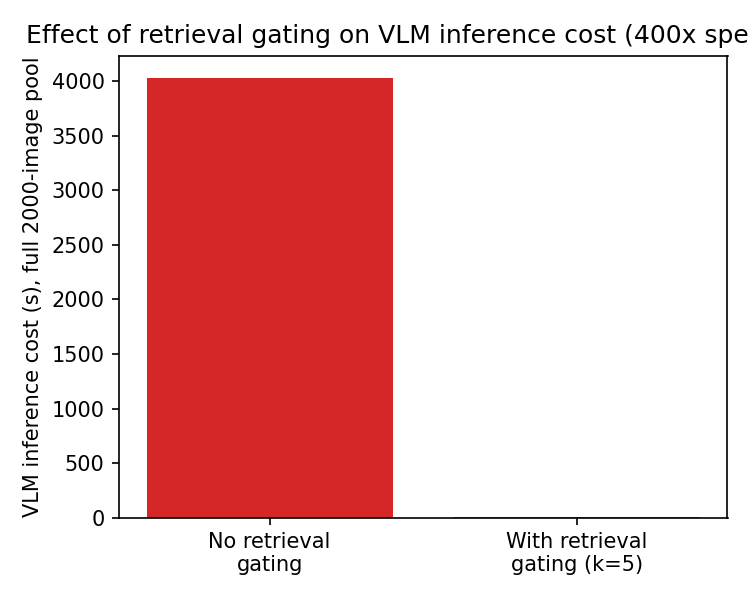

# Retrieval-Gated VLM Inference on Resource-Constrained Devices

Measuring where the budget actually goes in a fully local, retrieval-gated vision–language
pipeline — and finding that two textbook efficiency optimizations don't pay for themselves at
on-device scale.

Frozen CLIP ViT-B/32 → FAISS → SmolVLM2-256M, on one NVIDIA T4, over a 2,500-image offline
archive. No cloud round-trip at any stage.

Code and results for *Lightweight, Provenance-Aware Retrieval Gating for Vision–Language
Inference on Resource-Constrained Devices*, NeurIPS 2026 Workshop on On-Device Intelligence
([paper](paper/Chatterjee_Chattopadhyay_ODI2026.pdf)).

---

## The headline result

**INT8 quantization — the default "efficiency" lever on most deployment checklists — runs
7.69× slower than FP16 in this regime, while saving less memory than NF4.**

| Precision | Memory | Saving vs FP16 | Latency (s/image) | vs FP16 |
|---|---|---|---|---|
| FP16 | 489.2 MB | — | 1.401 | 1.00× |
| INT8 | 411.4 MB | 15.9% | 10.778 | **7.69×** |
| NF4  | 316.9 MB | **35.2%** | 1.778 | 1.27× |

INT8 is a strict regression against NF4 here: less memory saved *and* six times slower. The
cause is regime, not implementation — batch size one, a single resident model, one request in
flight. Mixed-precision decomposition overhead has no throughput to amortize against. A batched
server hides this cost; a device cannot.



## Why that happens: one stage owns the budget

| Stage | Cost | Ratio to VLM call |
|---|---|---|
| CLIP encode, 1 image (batch 64) | 4.89 ms | c_vlm / c_emb ≈ 410 |
| Exact query over 2,500 vectors | 0.089 ms | c_vlm / c_query ≈ 2.3 × 10⁴ |
| One SmolVLM2 call (FP16) | 1.40 s | — |

Indexing the entire 2,500-image collection costs about as much as a single k=5 gated query.
Every downstream conclusion follows from this asymmetry.

**Approximate search doesn't pay for itself at this scale.** HNSW reaches near-exact recall at
0.0196 ms/query against Flat's 0.0886 ms — a 0.07 ms saving against a 1.4 s VLM call, under
0.007% of the budget.

| Index | Query latency | Recall@10 vs exact | % of one VLM call |
|---|---|---|---|
| Flat | 0.089 ms | 1.000 | 0.0063% |
| IVF (nlist=64) | 0.020 ms | 0.963 | 0.0014% |
| HNSW (M=32) | 0.020 ms | 0.999 | 0.0014% |

And it costs real money on the maintenance side, which matters because offline archives are
append-heavy and query-light: HNSW is ~40× Flat to insert incrementally (5.70 ms vs 0.135 ms)
and ~37× to rebuild (81.4 ms vs 2.2 ms).




**Gate width `k` is the only dial with a measurable effect on end-to-end cost.** VLM cost varies
100× across the sweep below while the answer proxy moves by at most 0.033, non-monotonically.

| k | 1 | 5 | 10 | 25 | 50 | 100 |
|---|---|---|---|---|---|---|
| Speedup vs exhaustive | 2000× | 400× | 200× | 80× | 40× | 20× |
| Recall proxy @ k | 1.000 | 1.000 | 1.000 | 0.987 | 0.980 | 0.987 |
| Answer proxy | 0.667 | 0.667 | 0.700 | 0.683 | 0.683 | 0.683 |



## A cheap adapter narrows but does not close a domain gap

A 0.26M-parameter linear adapter (512×512 + bias, 0.17% of CLIP's parameters, identity-initialised,
trained with symmetric InfoNCE while CLIP stays frozen) improves retrieval in both domains. The
larger *relative* gain lands on the harder domain — and the gap between domains survives anyway.

| Domain | Adapter | R@1 | R@5 | R@10 |
|---|---|---|---|---|
| Flickr30k (general photos) | none | 0.592 | 0.834 | 0.889 |
| Flickr30k | joint | 0.684 | **0.890** | 0.942 |
| BDD100K (driving scenes) | none | 0.094 | 0.216 | 0.306 |
| BDD100K | joint | 0.160 | **0.344** | 0.458 |

For a deployment specialized to one visual domain — an on-vehicle dashcam archive is structurally
much closer to BDD100K than to general photography — a cheap adapter is not a substitute for
domain-matched retrieval quality. The limit looks like the frozen backbone, not the adapter budget.

(Recall here is in-sample — the adapter is evaluated on the pairs it was trained on.)

## Provenance comes free

Because the gate makes an explicit ranking decision *before* the expensive model runs, every query
can emit a structured record at a cost that is unmeasurable next to the dominant stage:

```json
{
  "trace_id": "8bc8d352-d3b1-4ac3-974a-ef7d9c7a0caa",
  "query": "a dog running on grass",
  "index_config": {"name": "flat", "k": 5},
  "retrieved_candidates": [{"image_idx": 1805, "similarity_score": 0.334}, ...],
  "vlm_model": "SmolVLM2-256M",
  "vlm_output": ["Yes", "Yes", "Yes", "Yes", "Yes"],
  "pipeline_latency_s": 11.93
}
```

This separates *why* an image reached the model (retrieval rank and score) from *what* the model
said about it. In [`results/day9_provenance_log.json`](results/day9_provenance_log.json), the
third logged query is the useful one: retrieval returns five confident candidates and the VLM
affirms exactly one, so gate and model visibly disagree — recoverable after the fact, from local
storage, with no second run and nothing sent off-device.

## Repository layout

```
├── notebooks/01_full_pipeline.ipynb   # linear, runnable, end-to-end
├── src/
│   ├── config.py       # device, model ids, dataset paths, index hyperparameters
│   ├── embed.py        # CLIP image/text embedding, SmolVLM2 inference
│   ├── index.py        # Flat/IVF/HNSW build, eval, maintenance benchmarks
│   ├── adapter.py      # LinearAdapter, InfoNCE training, recall@k
│   ├── quantize.py     # FP16/INT8/NF4 memory + latency ablation
│   └── provenance.py   # gated query with structured provenance record
├── results/            # every JSON, CSV and figure behind the tables above
└── paper/              # the write-up
```

The notebook is the reproduction path; `src/` is the same logic factored into importable modules
for anyone who wants to run one experiment rather than all of them.

## Reproducing

```bash
pip install -r requirements.txt
export DATASET_B_PATH="/path/to/bdd100k-scenario-classification/val/city street"
jupyter lab notebooks/01_full_pipeline.ipynb
```

**Data.** Flickr30k loads from the Hugging Face hub automatically (`nlphuji/flickr30k`, test split,
first 2,000 images — `revision="refs/convert/parquet"` is required to bypass the deprecated loading
script). BDD100K scenario-classification must be downloaded separately and pointed at via
`DATASET_B_PATH`; the first 500 `val/city street` images are used. Note the space in that directory
name.

**Hardware.** One NVIDIA T4 (16 GB), FAISS on CPU. Roughly 40–60 minutes end to end, most of it in
the quantization section — INT8 is slow, which is the finding.

**Artifacts.** Everything writes to `artifacts/` (gitignored). Embeddings, the FAISS index and the
trained adapter weights are all regenerable from the notebook and are deliberately not committed;
the JSON/CSV/PNG they produce are, in `results/`.

## Paper

*Lightweight, Provenance-Aware Retrieval Gating for Vision–Language Inference on
Resource-Constrained Devices.* Souparna Chatterjee\* (NIT Durgapur), Suchetana
Chattopadhyay\* (Jadavpur University). \*Equal contribution.

Accepted at the **NeurIPS 2026 Workshop on On-Device Intelligence: Foundation Models under
Real-World Constraints** (non-archival). Camera-ready PDF:
[`paper/Chatterjee_Chattopadhyay_ODI2026.pdf`](paper/Chatterjee_Chattopadhyay_ODI2026.pdf).

```bibtex
@inproceedings{chatterjee2026retrievalgating,
  author    = {Souparna Chatterjee and Suchetana Chattopadhyay},
  title     = {Lightweight, Provenance-Aware Retrieval Gating for Vision--Language
               Inference on Resource-Constrained Devices},
  booktitle = {NeurIPS 2026 Workshop on On-Device Intelligence: Foundation Models
               under Real-World Constraints},
  year      = {2026}
}
```

## License

MIT — see [LICENSE](LICENSE).
